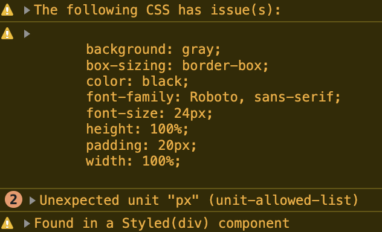

# @helious/emotion-mirror

[](https://www.npmjs.com/package/@helious/emotion-mirror)
[](https://npmcharts.com/compare/@helious/emotion-mirror?minimal=true)

Welcome to `@helious/emotion-mirror` - a way for us to utilize [`@emotion/react`](https://github.com/emotion-js/emotion/tree/main/packages/react)'s [`styled`](https://github.com/emotion-js/emotion/tree/main/packages/styled) that allows for self-reflection on the styles it creates. `@helious/emotion-mirror`'s wrapped `styled` will allow you to get real-time feedback on invalid (or lint issues, all via [`stylelint`](https://github.com/stylelint/stylelint)) CSS styles at runtime via the browser console when rendering your Styled Components!

## Install

```bash
npm i @helious/emotion-mirror
```

## Usage

`@helious/emotion-mirror` is intended to provide a direct replacement for `@emotion/react`'s `styled`.

More documentation is available at [https://emotion.sh/docs/styled](https://emotion.sh/docs/styled).

### `stylelint` Configuration

You may add any of the available [`stylelint` rules](https://stylelint.io/user-guide/rules/) and/or add overrides for the default rules using `configureRules`:

```jsx
import { configureRules } from "@helious/emotion-mirror";

configureRules({
    "unit-allowed-list": ["%", "px"],
    // Additional stylelint rules and/or overrides
    // ...
});
```

These are the default `stylelint` rules used:
- [annotation-no-unknown](https://stylelint.io/user-guide/rules/annotation-no-unknown)
- [at-rule-no-unknown](https://stylelint.io/user-guide/rules/at-rule-no-unknown)
- [block-no-empty](https://stylelint.io/user-guide/rules/block-no-empty)
- [color-no-invalid-hex](https://stylelint.io/user-guide/rules/color-no-invalid-hex)
- [comment-no-empty](https://stylelint.io/user-guide/rules/comment-no-empty)
- [declaration-block-no-duplicate-custom-properties](https://stylelint.io/user-guide/rules/declaration-block-no-duplicate-custom-properties)
- [declaration-block-no-duplicate-properties](https://stylelint.io/user-guide/rules/declaration-block-no-duplicate-properties)
- [declaration-block-no-shorthand-property-overrides](https://stylelint.io/user-guide/rules/declaration-block-no-shorthand-property-overrides)
- [font-family-no-duplicate-names](https://stylelint.io/user-guide/rules/font-family-no-duplicate-names)
- [function-calc-no-unspaced-operator](https://stylelint.io/user-guide/rules/function-calc-no-unspaced-operator)
- [function-linear-gradient-no-nonstandard-direction](https://stylelint.io/user-guide/rules/function-linear-gradient-no-nonstandard-direction)
- [function-no-unknown](https://stylelint.io/user-guide/rules/function-no-unknown)
- [keyframe-block-no-duplicate-selectors](https://stylelint.io/user-guide/rules/keyframe-block-no-duplicate-selectors)
- [keyframe-declaration-no-important](https://stylelint.io/user-guide/rules/keyframe-declaration-no-important)
- [media-feature-name-no-unknown](https://stylelint.io/user-guide/rules/media-feature-name-no-unknown)
- [named-grid-areas-no-invalid](https://stylelint.io/user-guide/rules/named-grid-areas-no-invalid)
- [no-duplicate-selectors](https://stylelint.io/user-guide/rules/no-duplicate-selectors)
- [no-invalid-double-slash-comments](https://stylelint.io/user-guide/rules/no-invalid-double-slash-comments)
- [no-irregular-whitespace](https://stylelint.io/user-guide/rules/no-irregular-whitespace)
- [property-no-unknown](https://stylelint.io/user-guide/rules/property-no-unknown)
- [selector-pseudo-class-no-unknown](https://stylelint.io/user-guide/rules/selector-pseudo-class-no-unknown)
- [selector-pseudo-element-no-unknown](https://stylelint.io/user-guide/rules/selector-pseudo-element-no-unknown)
- [string-no-newline](https://stylelint.io/user-guide/rules/string-no-newline)
- [unit-no-unknown](https://stylelint.io/user-guide/rules/unit-no-unknown)

Here is how you would disable any of the default `stylelint` rules:

```jsx
import { configureRules } from "@helious/emotion-mirror";

configureRules({
    "annotation-no-unknown": null,
});
```

### Example Output

This is what you can expect when using `styled` and there are issues in your component's styles:



### Production Mode

`@helious/emotion-mirror` is currently configured to only run Styled Components through `stylelint` when `process.env.NODE_ENV` is not set to `"production"`. When `process.env.NODE_ENV` is `"production"`, `@helious/emotion-mirror`'s `styled` will fall back to using `@emotion/react`'s `styled`.

## Contributors

`@helious/emotion-mirror` is maintained by [@helious](https://github.com/helious) and volunteers. Without the code contributions from [all these fantastic people](https://github.com/helious/emotion-mirror/graphs/contributors), `@helious/emotion-mirror` would not exist. [Become a contributor](CONTRIBUTING.md).
